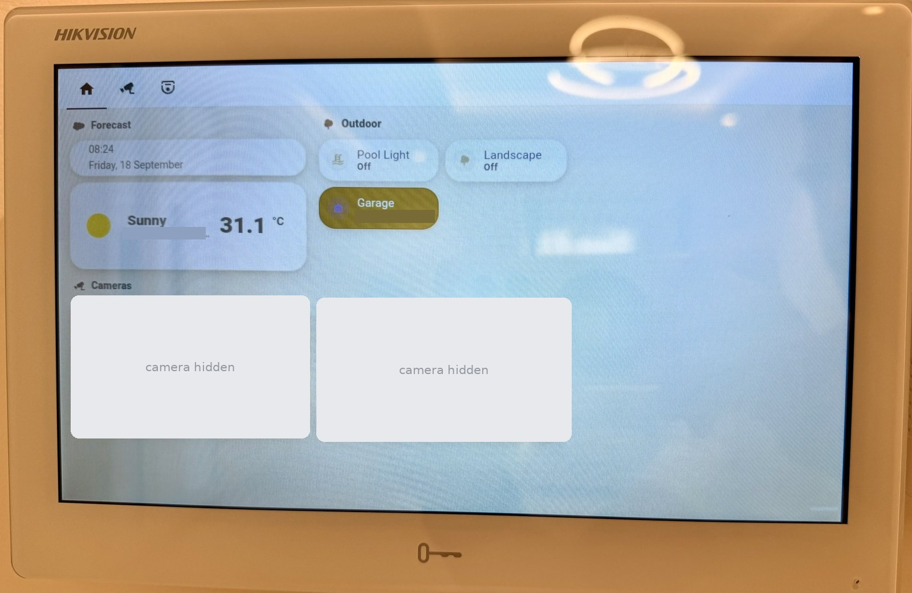

# HAKiosk

Turns a Hikvision indoor station into a Home Assistant wall panel.



*Running on the wall. The camera tiles are covered here on purpose -- they were
live views of a real house.*

The vendor firmware on these intercoms can install an APK but gives you no ADB,
no logcat and no web port — so this app is built to be readable **from its own
settings screen**, because that is the only window into it you get.

Tested on **DS-KH9 series, Android 10 (API 29)**, 1024x552. It should run on
anything from Android 4.4 up, but only that one model has been used in anger.

---

## What it does

- Opens your Home Assistant dashboard full screen, with a slim bar you can hide.
- **Night clock** — after an idle timeout, a dim clock covers the page. Touch it
  and the dashboard is back instantly. You can limit it to certain hours.
- **Comes back after a door call.** When the intercom takes over the screen for a
  call, this brings the panel back afterwards. Optionally it asks the outdoor
  station directly (ISAPI) so it returns within seconds instead of on a timer.
- **Survives a WebView renderer crash** instead of dying with it.
- **Restarts itself before Android kills it.** These panels slowly run out of
  memory. The app notices and restarts on its own, at a quiet moment, and is
  back on screen in a few seconds. See [Memory](#memory-and-why-it-restarts-itself).
- **Tells Home Assistant when a camera is open** (optional), so a motion popup
  does not take the screen from somebody who is already looking. See
  [Camera window](#camera-window-optional).
- **Records why it died.** Heartbeat, memory readings, trim warnings, crash
  handler, all on Settings → INFO. On hardware with no logs, this is the log.
- **Self-update** from a URL, since reinstalling by hand on these is tedious.

## What it does not do

- It is **not** a replacement for the intercom. Calls, unlocking and the answer
  screen all stay with the vendor app.
- **Do not make it the home app.** On these stations that breaks the intercom's
  answer screen when a call comes in. There is a button for it in Settings and an
  escape hatch next to it, but the honest advice is: don't.
- No rooting, no firmware modification, nothing clever. It is an ordinary APK.

---

## Install

You need the APK reachable over HTTP on your LAN. The easy place is Home
Assistant's own `www` folder, which is served without a password.

**1. Put the APK where the panel can fetch it**

Copy `dist/HAKiosk.apk` into Home Assistant at `/config/www/HAKiosk.apk`.
It is then at:

```
http://<your-ha-address>:8123/local/HAKiosk.apk
```

Open that URL in a browser first and check it downloads. If it 404s, the panel
will not get it either.

> The HA SSH add-on ships no sftp subsystem, so `scp` and `rsync` both fail with
> "subsystem request failed". Pipe it over ssh stdin instead:
> `ssh root@<ha> "cat > /config/www/HAKiosk.apk" < dist/HAKiosk.apk`

**2. Install it from the indoor station**

On the panel, use the vendor app's own APK install option and give it that
download address. Accept the prompts. There is no ADB on these — this is the
only route in.

**3. Point it at your dashboard**

Open HAKiosk → the gear icon → **Address**, and type your dashboard URL, for
example `http://homeassistant.local:8123/lovelace/0`. Tap **Save and reload**.

That's it. Everything below is optional.

---

## Settings worth knowing

| Setting | What it does |
|---|---|
| **Come back after a door call** | After the intercom takes the screen, return to the panel 4 minutes later. The wait is deliberate — the panel cannot tell when a call ends, so coming back sooner risks covering a live call. |
| **Keep this bottom bar hidden** | Starts hidden; tap the small line bottom-right to raise it. It hides again after 8 seconds. |
| **Show the clock after** | Idle minutes before the dim night clock covers the page. `Never` disables it. |
| **Only between** | Limits the clock to a time window. A window may cross midnight. |
| **Rest the page under the clock** | Stops *drawing* the dashboard while the clock covers it, to use less memory overnight. The page keeps running, so HA can still push a camera to the panel and the clock still steps aside for it. Default on. |
| **Sound volume** | Media volume for a camera opened on the panel. `Leave` keeps whatever the panel is set to. |
| **Restart the app now** | Does the same restart the memory guard does, on demand. The panel should be back within a few seconds; if it is not, the guard will not bring it back either. |

### Door station (optional)

If you fill in the outdoor station's address and password under **DOOR STATION**,
the panel asks it over ISAPI whether a call is still up, and returns as soon as
it ends instead of waiting the 4 minutes. User is `admin` on a factory station.

Leave it blank and the plain timer is used. That works fine — it is just slower.

The password is stored in the app's private preferences on the panel. Bear in
mind the APK itself is usually served unauthenticated from `/local/`, so never
bake a password into a build.

---

## Memory, and why it restarts itself

On these panels free memory drains while the dashboard is up — faster with a
camera on screen — until Android kills the app, usually in the small hours. The
panel is then stuck on the vendor launcher until somebody touches it.

The memory is not held anywhere the app can measure: not the Java heap, not
PSS, not the graphics counters. It behaves like hardware video buffers that a
driver holds for the process and frees only when that process ends. A page
reload frees nothing. Ending the process frees all of it (~870 MB after a day).

So since v1.25 the app does not try to fix the leak. It avoids the death:

- Below **400 MB** free, it restarts once the night clock is up (nobody is
  looking).
- Below **250 MB** free, it restarts even if somebody is, because a short
  interruption beats a dead panel.
- Never more than once every **two hours**, so a restart that does not help
  cannot turn into a loop.
- During a door call it waits. It only restarts from the background once the
  app has been hidden longer than any call could last.

The on-screen restart is proven: days of use with restarts and no deaths. The
background restart is **not proven yet**. On the panels this was written on it
has never been needed (`0 bg` so far), so treat it as untested.

A restart takes about three seconds of black screen. Settings → INFO counts
them on the `Self-restart` line, apart from real deaths.

---

## Camera window (optional)

Since v1.29 the app tells Home Assistant whether a camera (any more-info
dialog) is open on the panel. It checks every five seconds and posts to a
webhook on the same Home Assistant the dashboard is on: once on every change,
and again every five minutes. Home Assistant cannot see this by itself.

Use it to stop an automation from putting a popup over a camera somebody opened
by hand. The panel names itself by the `?BrowserID=` in its dashboard address,
so give each panel one, e.g. `http://homeassistant.local:8123/lovelace/0?BrowserID=panel-1`.

The Home Assistant side is in [docs/camera-window.yaml](docs/camera-window.yaml):
one timer per panel and one automation. If you do not set it up, the posts go
nowhere and nothing else changes.

---

## Settings → INFO, and how to read it

This screen is the whole diagnostic story on hardware with no logs.

```
Version: 1.29 (30)
Last run: installed Sep 23 10:26  v29->v30, before that 9x died, last Sep 20 01:42  free 920M/1954M ...
Into death: 01:42 f920 a105 g0 n482 | 01:41 f928 a104 g0 n482 | ...
Memory: free 608M/1954M lowram  app 284M  heap 2M/128M
App: pss 283M java 3M native 148M gfx 0M code 65M other 17M swap 38M
Sys: anon 565M  cache 561M  shmem 91M  slab 203M  swap 344M/977M
Pressure: none this run
Self-restart: 15x, 0 bg, last Sep 23 01:07  free 400M
Also: renderer 0, crash 0, rebuilt 0
```

- **`Last run`** — `ended cleanly` is the good answer. Anything else is a time of
  death, with the memory reading from the last minute the app was alive. That
  reading cannot be recovered any other way.
- **`Into death`** — the last few heartbeats before that death, newest first.
  `f` is free memory, `a` is how much of it this app was holding, `g` graphics
  memory, `n` the system's anonymous memory. `a` rising as `f` falls means the
  app is the problem; `a` flat while `f` falls means something else on the
  device is.
- **`app`** — the process's total PSS. Watch this one, not `heap`: a WebView
  keeps almost everything it holds outside the Java heap, so `heap` can sit at
  2M while the process grows by hundreds of megabytes.
- **`App`** — this process as Android itself counts it, split into Java heap,
  native heap, graphics, code and swap. PSS alone misses graphics and swap.
- **`Sys`** — the device's `/proc/meminfo`: what *kind* of memory went. If these
  add up to much less than what disappeared, it is in hardware buffers that
  no counter shows.
- **`Pressure`** — the worst `onTrimMemory` level this run, kept separately for
  while the app is on screen (`RUN_CRITICAL(15)` is Android's last warning before
  it starts killing) and while it is hidden (`bg`). `hidden` is only the time the
  app first went to the background — not a memory warning.
- **`Self-restart`** — restarts the memory guard chose, how many of those were
  from the background (`bg`), and the free memory at the last one. A restart
  with no matching death is the guard working.
- **`Also`** — the three failures that are *not* happening. It expands into full
  lines the moment any of them is not zero.
- **`UA`** — the WebView version, which decides what your dashboard can use.
  These panels have no web port, so this screen is the only place to read it.

Installing a new APK does **not** count as a death since v1.27. `Last run` shows
`installed ... v29->v30` instead, and keeps the last real death after it.

---

## Build from source

Needs a JRE with `jdk.compiler` (most have it) and the Android build tools:

```bash
tools/fetch-tools.sh     # downloads aapt, zipalign, d8, apksigner, android.jar
./build.sh               # -> dist/HAKiosk.apk
```

No Gradle, no Android Studio. The script explains itself; the short version is
that `aapt2` ships x86-only, so this uses `aapt` v1 from Ubuntu's arm64 packages
plus the pure-Java `d8` and `apksigner` jars.

**Signing.** The first build generates `keystore/hakiosk.jks` if there isn't one.
**Keep it.** Android refuses to upgrade an app that was signed with a different
key — you would have to uninstall first, losing every setting. `keystore/` is
gitignored for the same reason a password is: it is yours, do not publish it.

### Layout

```
app/src/io/github/ridanuae/hakiosk/
  MainActivity.java     WebView host, renderer-crash recovery
  Vitals.java           heartbeat, run flag, trim, crash handler  <- read this first
  MemoryGuard.java      restarts the app before memory runs out
  WindowWatch.java      tells HA when a camera window is open
  ScreenSleeper.java    night clock, and resting the page under it
  DialogProbe.java      asks the page whether a camera dialog is open
  PanelWatchdog.java    coming back after a door call
  DoorStation.java      ISAPI call-state query
  Updater.java          self-update over HTTP
  SettingsActivity.java the settings + INFO screen
```

The source has **no anonymous inner classes** anywhere, deliberately: the `d8`
version used here cannot read the ones javac 21 emits. Named nested classes only.

---

## Known quirks of this hardware

Worth knowing before you spend an evening on any of them:

- **`AudioManager` tells you nothing.** `isMusicActive()` stays stuck `true`
  after playback ends, `getActivePlaybackConfigurations()` sticks too, and
  `getMode()` never leaves `MODE_NORMAL` even during a door call. Four versions
  were spent learning this. Ask the page, or ask the door station.
- **No `uiMode` in `configChanges`** is deliberate, so a vendor day/night switch
  recreating the activity can still be *counted* on the INFO screen.
- **The panel has no ADB, no logcat and no web port.** Only ports 554 and 8000
  answer. Everything you learn, you learn from the settings screen.

---

## License

MIT — see [LICENSE](LICENSE).

Shared as-is, as a personal project that happens to work on one model of
intercom. No warranty, and no affiliation with Hikvision or Home Assistant.
